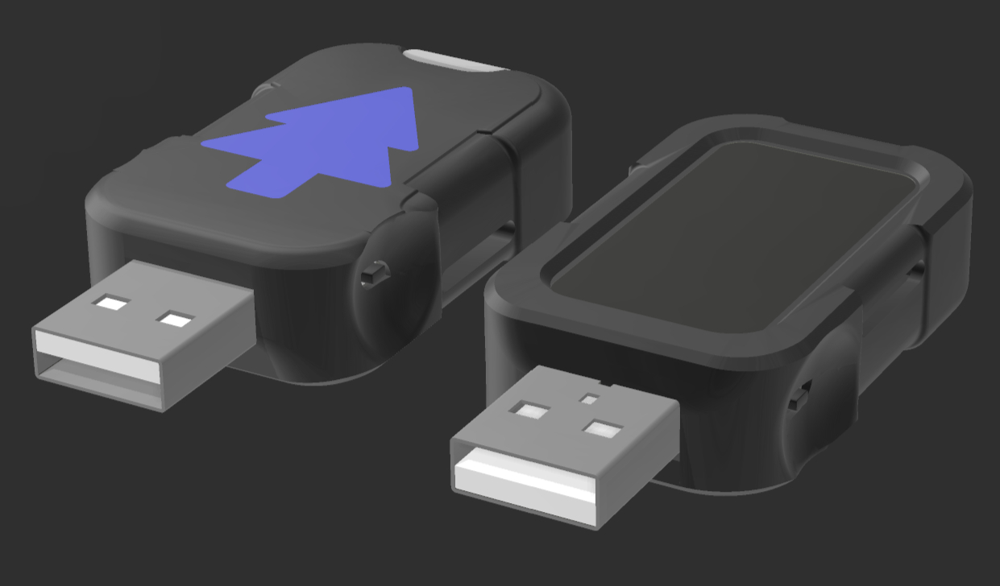
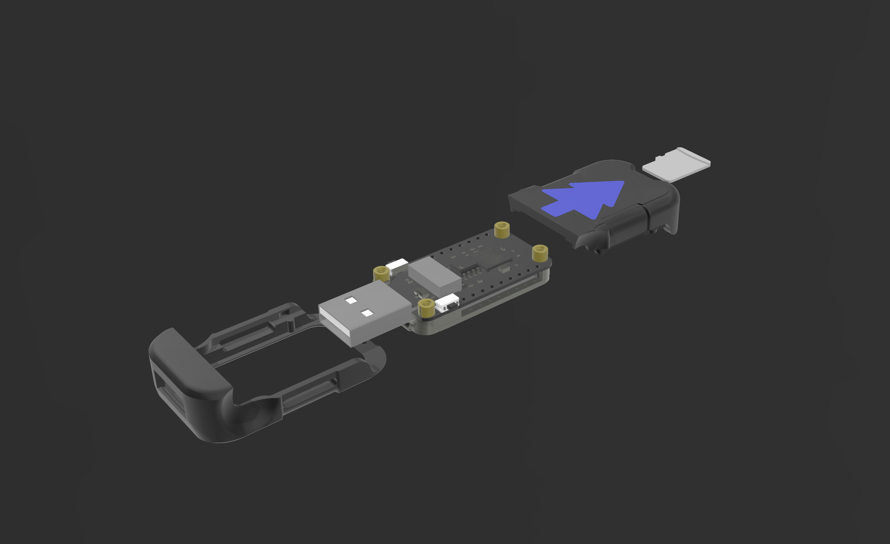

# <div align="center">Jcorp Nomad</div>

<div align="center">
  
</div>

<p align="center"><b>A portable, offline media server powered by the ESP32-S3 in a thumbdrive form factor.</b><br>
Stream movies, music, books, and shows anywhere - no internet required.</p>

<p align="center">
  
  
  
  
</p>

<p align="center">
  <a href="https://nomad.jcorptech.net"><b>Buy a Prebuilt Nomad</b></a> &nbsp;|&nbsp;
  <a href="https://ko-fi.com/jcorptech"><b>Support on Ko-fi</b></a>
</p>

---

> **Mk4 Release** - A big one. Full offline Wikipedia support, a redesigned case, and a long list of stability fixes under the hood. This update touches both firmware and frontend, so a reflash is required coming from Mk3. Still semi-stable while I iron out edge cases, but everything core is working well.

---

## What is Nomad

Jcorp Nomad is an open-source offline media server designed for travel, remote work, classrooms, camping, and more. It runs entirely on an ESP32-S3, creates a local Wi-Fi hotspot, and serves media through a browser interface. Multiple users can access separate media streams simultaneously, all without internet access.

This project is compact, easy to modify, and includes optional 3D-printable hardware. Both firmware and web interface are fully open-source.

---

## Get a Nomad

### Build It Yourself (Recommended)

I strongly recommend building your own Nomad. It's not a very difficult project, if you can follow instructions and plug in a USB cable, you can do it. The parts are cheap, widely available, and the whole build takes under an hour. See Hardware Requirements and Quick Start below. If nothing else please check out the DIY option before purchasing. 

### Buy a Prebuilt

That said, I also won't say no to money. If you'd rather skip the DIY and get a ready-to-go unit, prebuilt Nomads are available at **[nomad.jcorptech.net](https://nomad.jcorptech.net)**.

Every Nomad, whether you build it or buy it, runs the same open-source firmware and web interface. When new features and updates are released, you can always flash the latest code yourself to stay up to date. This project isn't going anywhere. 

### Support Development

If you just want to support the project, donations are always appreciated:  
**[ko-fi.com/jcorptech](https://ko-fi.com/jcorptech)**

---

## Mk4 Highlights

### Offline Wikipedia & Archive Support (ZIM)
- Browse and search full offline Wikipedia (and other ZIM archives like Gutenberg and TED) directly from the SD card
- Search is fast even on massive archives, the companion [Nomad Tools](https://github.com/Jstudner/Nomad-Tools) app prebuilds a compact index on your PC, so the device never has to search the raw multi-gigabyte file itself
- Embedded videos and epub books inside archives play/read right in the browser
- Works with zero extra UI cost if you don't use it, no archives on the card means the feature stays completely out of the way
- Currently tested with Gutenburg epubs, TedX Videos, and wikipedia from the tiny 0.8 file all the way to the 140gb maxi with images. 

### Redesigned Case
<p align="center">
  
</p>

- New case slides together **front-to-back** instead of the old top-to-bottom design
- No more direct pressure on the screen, which was a common cause of cracked/broken screens on the old case
- Buttons stay exposed on the outside, so you can still flash firmware or hit the boot button without disassembling anything

- Based on a remix of [ESP32 C6 with LCD Screen Enclosure Case](https://makerworld.com/en/models/2121443-esp32-c6-with-lcd-screen-enclosure-case) on MakerWorld by [**Adrian**](https://makerworld.com/en/@user_1765744671), full credit to the original design this was built on

### Indexing & Stability
- Root-caused and fixed a long-standing random reboot bug tied to files over 2GB, this was the actual cause of crashes on image-heavy Wikipedia pages and big movie scrubbing
- Fixed a heap-corruption crash that could hit when indexing and refreshing SD totals at the same time
- Boot-time indexing now only re-scans when files have actually changed, instead of a full scan on every boot
- Removed the screens loading spinner that was silently forcing a full-screen redraw every loop, pulling it out made the whole device noticeably more stable

### Reader & Memory Improvements
- Comic and PDF readers now free old pages from memory as you scroll, fixing crashes on long comics and scanned PDFs
- PDF viewer shows a real loading percentage instead of a blank screen
- Cleaned out a bunch of dead code and unused libraries that were loading on every Books page

### UI & Admin Updates
- Unified header and button styling across pages so themes apply consistently everywhere
- Fixed several dark mode readability bugs (unreadable resume text, buttons that ignored custom themes, etc.)
- Admin panel settings are now gated behind a login
- Fixed a stuck brightness slider caused by an out-of-range default value

### Default Themes (28)

Default Blue, Forest Night, Cherry Blossom, Mocha Latte, Ocean Depths,
Autumn Leaves, Lavender Fields, Sunset Horizon, Coral Reef, Mountain Mist,
Jade Garden, Desert Sand, Arctic Aurora, DeLorean, Midnight Code, 90s Retro,
Mint Breeze, Rose Gold, Crimson Night, Emerald Dream, Royal Purple,
Copper Sunset, Sapphire Sea, Peach Cream, Slate Storm, Lime Zest,
Burgundy Wine, Teal Oasis

---

## Features

- **Offline Encyclopedia:** ZIM archive support for offline Wikipedia and other offline wikis, with fast on-device search.
- **Admin Panel:** Full device controls, library indexing, Theme Customizer, login-gated settings.
- **File Browser:** Upload, rename, delete, download, and inline file editing. (Recommended to use a PC)
- **Global Search:** Quickly find media across all categories from the Menu page.
- **Music Player:** Seamless background playback with subdirectory playlists and a dynamic Queue.
- **Movies & Shows:** Plyr-integrated playback with season/special folder support.
- **Digital Library:** EPUB support, PDF handling, and a dedicated Comic/Webtoon reader.
- **Resume Tracking:** Saves playback progress for Movies, Shows, and certain Books.
- **Gallery & Files:** Dedicated pages for image viewing, video clips, and general file sharing.
- **Captive Portal:** Automatic login/redirection for easy access.
- **Persistent Settings:** Themes and system configurations saved across reboots.
- **Mobile-Friendly UI:** Fully responsive design optimized for handheld offline streaming.

---

## Hardware Compatibility

Nomad is built specifically for the **Waveshare ESP32-S3 Dev Board (1.47" LCD version)**. Due to the number of low-level tricks used to squeeze this much functionality out of the hardware, it is difficult to get Nomad running on other boards.

There are a few community forks that target other ESP32 boards, but your mileage will vary. I'm also actively working on a **Nomad Lite** version with wider board compatibility, focused on basic streaming without all the advanced features.

---

## Hardware Requirements

- **Waveshare ESP32-S3 Dev Board (1.47" LCD version)**
  [Amazon Link](https://amzn.to/4ktB6oT)

- **FAT32 microSD card (16-128GB recommended, up to 2TB)**
  [Amazon Link](https://amzn.to/44tM1c4)

- **SD-Card Extender (optional, 3DP case compatible)**
  [Amazon Link](https://amzn.to/45IWIJz)

- **USB power source**
- **Optional:** 3D-printed enclosure (STL files included)

---

## Software Requirements

- Arduino IDE
- Fat32Format or equivalent
- SquareLine Studio (optional, for UI editing)

---

## Quick Start

1. Flash ESP32-S3 firmware from `/firmware/`.
2. Format SD card as FAT32 and copy `/SD_Card_Template/` files.
3. Place media in `/Movies`, `/Shows`, `/Books`, `/Music`, `/Gallery`, `/Files`.
4. Insert SD card and power device via USB.
5. Connect to Wi-Fi `Jcorp_Nomad` with password: `password`.
6. Open the browser interface.
7. Click the gear icon → Library Index → **Full Scan Now**.
8. Monitor Admin Console for progress; scan may take minutes.
9. Return to Menu page and enjoy your media!

---

## Key Improvements

1. **Faster & More Reliable Indexing**
   - Non-blocking, background indexing for large libraries.
   - Safe on power loss; partial indexes remain intact.
   - Auto-updates changes; frontend detects updates automatically.
   - Boot-time indexing now only triggers on an actual file change, not every boot.

2. **Resume Functionality**
   - Movies and Shows track playback progress.
   - Options for **Play from Start** or **Resume**.
   - Menu displays last three movies/shows; mobile shows most recent.

3. **Dark Mode**
   - Toggleable across all pages from the menu.
   - Consistent theme tokens across pages, no more mismatched dark colors.

4. **Admin Page**
   - Full device control: shutdown, restart, flash mode, Wi-Fi, RGB LEDs, brightness, credentials, indexing, and file management.
   - Login-gated settings so changes require the admin password.
   - Safe shutdown option for SD card health.
   - Real-time system console feedback.

5. **Stability Improvements**
   - Fixed frontend NDJSON sync issues.
   - Crash recovery on large indexes.
   - Fixed a random-reboot bug tied to files over 2GB.
   - Dynamic LCD brightness adjustment.
   - Streaming stability enhancements.

6. **Improved Library Support**
   - Supports deeper folder structures for Shows and Music.
   - Flexible organization; media files can be nested at any level.

---

```
Folder Structure

/Movies
    Interstellar.mp4
    Interstellar.jpg

/Shows
    /The Office
        S01E01 - Pilot.mp4
        S01E02 - Diversity Day.mp4
    The Office.jpg

    /Gravity Falls
        /Season 1
            S1E1 - Tourist Trapped.mp4
            S1E2 - The Legend of the Gobblewonker.mp4
        /Season 2
            S2E1 - Scary-oke.mp4
            S2E2 - Into the Bunker.mp4
        Alex Hirsch Interview.mp4
    Gravity Falls.jpg

/Books
    The Martian.pdf
    The Martian.jpg
    /How to Train Your Dragon
        book1.pdf
        book2.mp3
        book1.jpg
        book2.jpg
    How to Train Your Dragon.jpg

/Music
    track01.mp3
    /Artist1
        track01.mp3
        /Album1
            track02.mp3
    /PersonName
        /Playlist1
            track01.mp3
        /Playlist2
            track02.mp3

/Gallery
    image01.jpg
    video01.mp4

/Files
    document.pdf
    example.txt

index.html
appleindex.html
menu.html
movies.html
shows.html
books.html
music.html
gallery.html
files.html
archive.html
Logo.png
favicon.ico
```

---

## Supported Formats

- **Video:** `.mp4, .webm, .m4v, .mov, .mkv, .ts, .m2ts` 
- **Audio:** `.mp3, .flac, .wav, .ogg, .aac, .m4a`
- **Books:** `.pdf, .epub, .cbz, .cbr` 
- **Images:** `.jpg, .jpeg, .png` 
- **Archives:** `.zim` (offline Wikipedia and other ZIM-format wikis), needs special processing, you cant just drop a .zim in sadly. Prep them with [Nomad Tools](https://github.com/Jstudner/Nomad-Tools) first (still rough, but handles most common ZIMs)

---


## 3D Printed Case Files

The Mk4 default case is a remix of [ESP32 C6 with LCD Screen Enclosure Case](https://makerworld.com/en/models/2121443-esp32-c6-with-lcd-screen-enclosure-case) on MakerWorld, credit to [**Adrian**](https://makerworld.com/en/@user_1765744671) for the original design. It's a front-to-back slide design that keeps pressure off the screen while still exposing the buttons for firmware access.

- Mk4 case files: in this repo
- Original Mk3 top/bottom case (still works, just more prone to screen pressure): [Thingiverse](https://www.thingiverse.com/thing:7223398)

---

## What's Next

**Nomad Lite** - A stripped-down version of Nomad with wider board compatibility, focused on core streaming features. In active development now that Mk4 is out.

**Nomad Manager** - A companion application for Nomad that integrates with Jellyfin to handle automated media downcoding and transfers, and builds the offline archive indexes used by the ZIM reader. Keep your Nomad stocked and ready to go without manual file management.

**Gallion** - A larger-scale sibling to Nomad, built on more capable hardware. Gallion is designed to handle everything that couldn't fit on Nomad's current platform > ROM emulation, 4k video, and expanded media compatibility across the board. The current version is [here](https://github.com/Jstudner/Gallion).

---

## Project Inspiration

Inspired by my experience running a Jellyfin server, I wanted a portable, low-cost solution for offline media streaming. Challenges with SBCs (Raspberry Pi, etc.) included high power usage, heat, and instability.

Nomad focuses on delivering:

- Offline access
- Wide device compatibility
- Simple frontend for media browsing and playback
- Multiple user support
- High customization potential

The ESP32-S3 provides enough performance to handle these requirements efficiently, in a pocket-sized form factor.

---

## License

[CC BY-NC-SA 4.0](https://creativecommons.org/licenses/by-nc-sa/4.0/) - free to remix and share for non-commercial use with attribution.

---

## Credits

Developed by **Jackson Studner (Jcorp Tech)**.
Mk4 case design based on a remix of [**Adrian**](https://makerworld.com/en/@user_1765744671)'s [ESP32 C6 LCD Screen Enclosure Case](https://makerworld.com/en/models/2121443-esp32-c6-with-lcd-screen-enclosure-case) on MakerWorld.
Inspired by open-source offline media projects. Contributions via PRs welcome.

<p align="center">
  <a href="https://ko-fi.com/jcorptech"></a>
</p>
